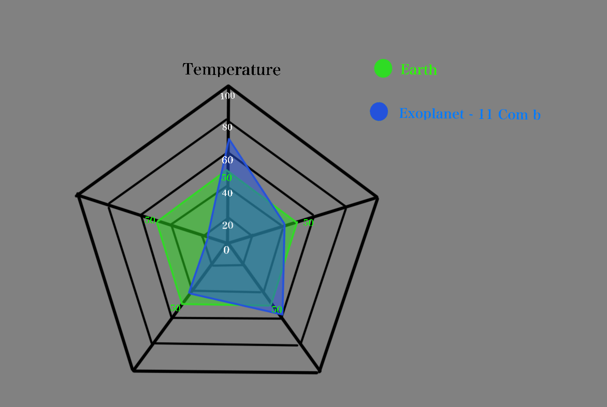
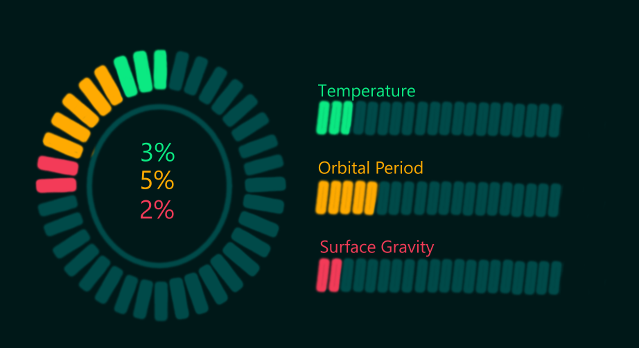
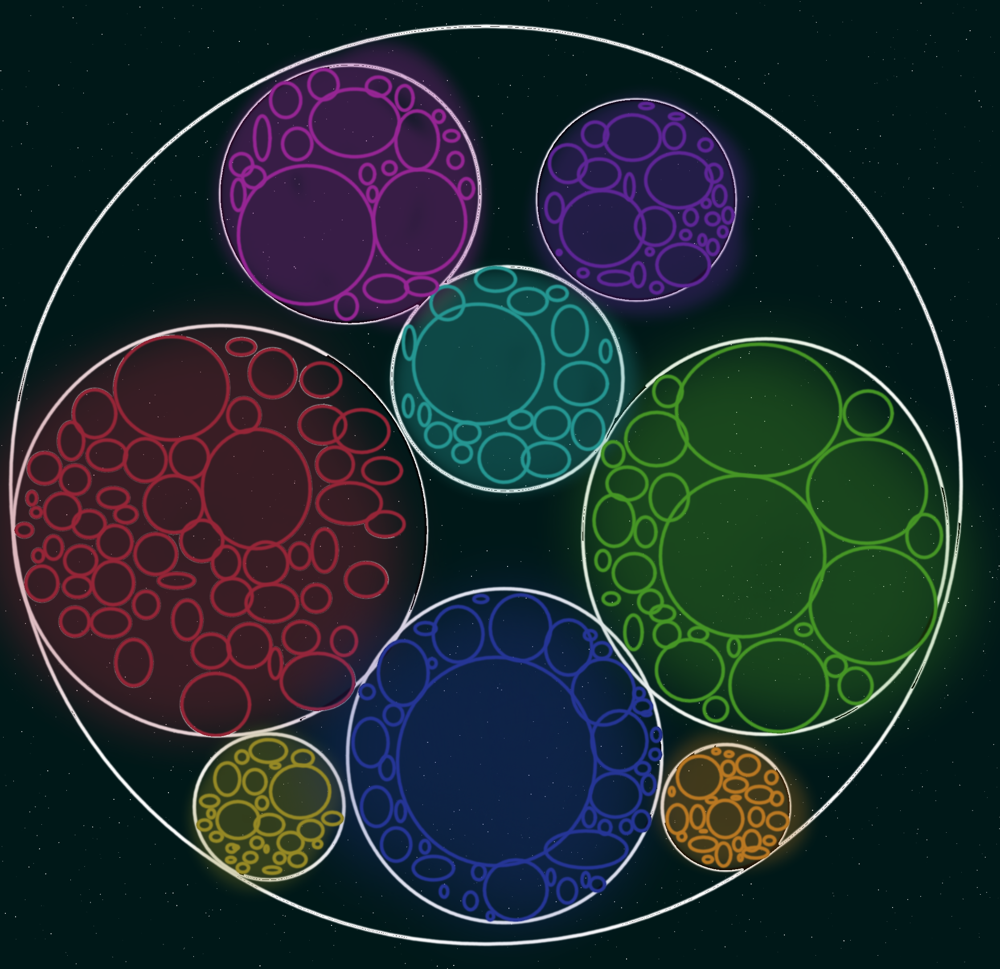

# Project of Data Visualization (COM-480)

| Student's name     | SCIPER |
|-------------------|--------|
| Mohamed Bouchnak  | 327170 |
| Hugo Heinkélé     | 326309 |
| Hong Wei          | 422972 |
| Gustavo Maia      | 357154 |

[Milestone 1](#milestone-1) • [Milestone 2](#milestone-2) • [Milestone 3](#milestone-3)

## Milestone 1 (20th March, 5pm)

**10% of the final grade**

This is a preliminary milestone to define the goals of the project and assess the feasibility of the chosen idea.

*(max. 2000 characters per section)*

## Dataset
> Find a dataset (or multiple) that you will explore. Assess the quality of the data it contains and how much preprocessing / data-cleaning it will require before tackling visualization.
>
> Hint: some good pointers for finding quality publicly available datasets (Google dataset search, Kaggle, etc.).

The dataset used in this project comes from the NASA Exoplanet Archive and contains detailed information about confirmed exoplanets and their host stars. Each row corresponds to a detected exoplanet, with features describing both the planet and the star it orbits.

The dataset includes key variables such as planet mass (`pl_bmasse`), radius (`pl_rade`), orbital period (`pl_orbper`), equilibrium temperature (`pl_eqt`), and discovery method (`discoverymethod`). It also contains information about the host star, such as its mass, radius, and effective temperature.

This dataset is widely used in scientific research and provides a large number of observations, making it suitable for identifying patterns and relationships between planetary and stellar properties.
However, the dataset contains missing values and some inconsistencies, which will require preprocessing (e.g., filtering relevant features and handling missing data) before performing meaningful analysis and visualization.

Dataset: https://exoplanetarchive.ipac.caltech.edu/cgi-bin/TblView/nph-tblView?app=ExoTbls&config=PS&constraint=default_flag=1&constraint=disc_facility+like+%27%25TESS%25%27

## Problematic
> Frame the general topic of your visualization and the main axis that you want to develop.
>
> - What am I trying to show with my visualization?
> - Think of an overview for the project, your motivation, and the target audience.

The main objective of this project is to explore how exoplanets differ from each other and to understand how common Earth-like planets are within the currently known population. Through our visualizations, we aim to highlight the distribution of key characteristics such as planet mass, radius, orbital period, and temperature, and to identify where Earth-like planets are located within these distributions.

More specifically, we want to show whether planets similar to Earth are rare or simply underrepresented due to current detection methods. By comparing different features and observing potential patterns or clusters, we aim to better understand the diversity of exoplanets and the limits of current observations.

Our motivation comes from the increasing interest in discovering habitable planets and understanding our place in the universe. This project is intended for a general audience with basic knowledge of science, as well as students interested in astronomy and data visualization. The goal is to present complex astronomical data in a clear, intuitive, and visually engaging way.

## Exploratory Data Analysis
> Pre-processing of the data set you chose
>
> - Show some basic statistics and get insights about the data

Before performing visualizations, we will preprocess the dataset by handling missing values and selecting the most relevant features (such as planet mass, radius, and orbital period). We will also ensure consistency in units when necessary.

We will then compute basic statistics (mean, median, distribution) and visualize key variables to better understand the structure of the data. This step will help identify patterns, outliers, and potential relationships between variables, which will guide the rest of the analysis.

All preprocessing and analysis steps will be implemented in the `analysis.ipynb` notebook.

## Related Work
> - What others have already done with the data?
> - Why is your approach original?
> - What source of inspiration do you take? Visualizations that you found on other websites or magazines (might be unrelated to your data).
> - In case you are using a dataset that you have already explored in another context, you are required to share the report of that work to outline the differences with the submission for this class.

Previous work on exoplanet datasets has mainly focused on classifying planets based on their physical properties (such as mass and radius), studying detection methods, and identifying general trends in exoplanet populations. Many visualizations highlight the diversity of exoplanets or compare discovery techniques (e.g., transit vs radial velocity). For this milestone, we have identified these common approaches but have not yet conducted an in-depth comparison with specific prior studies. This will be developed in later stages of the project.

Our approach is original in that we focus specifically on identifying Earth-like planets and analyzing how their apparent rarity may be influenced by detection biases. Instead of only describing the dataset, we aim to combine multiple features (such as size, temperature, and orbital characteristics) to better understand where Earth-like planets lie within the overall distribution.

In terms of inspiration, we draw from existing scientific visualizations and online platforms that present astronomical data in an accessible and interactive way. This includes space-related dashboards, educational visualizations, and data storytelling websites that emphasize clarity and visual exploration.

We are not reusing a dataset previously explored in another course or project.

## Milestone 2 (17th April, 5pm)

**10% of the final grade**

## Project Goal

Our project aims to explore confirmed exoplanets discovered by the Transiting Exoplanet Survey Satellite (TESS) and compare several characteristics related to planetary habitability. The website will use data from the NASA Exoplanet Archive to analyze the properties of known exoplanets and visualize their similarity to Earth, which will serve as the reference point.

The goal of our visualization is to help users understand how different exoplanets are from Earth and which characteristics might make a planet potentially habitable. One of the main challenges we face is handling a very large dataset containing numerous scientific attributes and presenting it in an interactive and comprehensible way so that our intended message is clearly communicated.

Another important challenge concerns data scaling. Because we are working on a cosmic scale, many variables differ greatly in magnitude. Maintaining graphical integrity and clarity becomes complex, as we must carefully choose appropriate designs, graphs, and statistical transformations. Accurate data manipulation and the creation of consistent scaling methods will be necessary to ensure that the visualization remains both accurate and understandable.

## Core Concept and Skeleton

Taking inspiration from common design approaches used in universe-related websites, we aim to maintain a familiar and intuitive structure.

The user's first impression of the website is crucial. The homepage will clearly introduce the theme and provide an entry point into the experience. We plan to use a dark color palette with space or planet-themed background imagery to create an immersive environment.

From the homepage, users will be able to choose between exploring the Universe or viewing data about known exoplanets through different visualizations. The homepage will also explain our project objective and introduce the planetary characteristics related to habitability along with more details on what exactly are exoplanets.

Users will have the freedom to explore the content in different ways. They may either directly enter the Universe exploration interface (our main visualization) or visit additional pages containing background information about exoplanets before diving into the interactive experience.

Users who choose to explore the Universe will be taken to our main visualization page. This page will simulate a view from space, where small white interactive dots represent exoplanets available for exploration. When hovering over a dot, users will see the name of the exoplanet and its distance from Earth. Clicking on a dot will display detailed information about the selected planet.

The selected exoplanet will be compared with Earth through multiple visualizations, including a spider chart and a habitability score graph, along with a short textual description of the planet.

## Sketches & Visualization

Our central visualization concept presents Earth surrounded by distant exoplanets.

This interface is designed to feel interactive and engaging. Most users will likely explore exoplanets randomly at first, simply to observe how different known planets are from Earth.

We will also add filtering options to allow users to explore the dataset more systematically and better understand the vastness of space and the difficulty of finding planets similar to Earth.

When a user clicks on an exoplanet, they will be redirected to a page displaying several visualizations:

The first visualization will be a spider (radar) chart comparing Earth and the selected exoplanet across several key attributes.

This is an effective way to compare multiple characteristics simultaneously. The attributes used in this chart will include:

- Surface temperature
- Orbital period
- Surface gravity
- Planetary radius
- Stellar radiation

Earth will serve as the reference point, representing an ideal baseline for habitability. By comparing each exoplanet to Earth, users can quickly see how similar or different the planet is.

This comparison method also creates a somewhat game-like exploration experience, making complex scientific information easier to understand for a general audience.

The page will also include a graph that displays a habitability score computed from several key parameters.

This score provides a simplified indicator of how suitable a planet might be for life based on its measured characteristics.

Additional textual information about the exoplanet will also be displayed to provide further context.

## Tools

For the current version of our website, the visualization primarily uses D3.js to render scatter plots and interactive elements such as tooltips.

Specifically, we use:

- d3-scale for scaling data values
- d3-axis for creating chart axes
- d3-zoom to enable panning and zooming interactions

For future implementations, we plan to create additional comparison views to help users better understand the differences between exoplanets.

In particular, we will implement the spider chart using D3.js, using Earth as the baseline reference.

Each visualization will apply an appropriate scaling method to ensure that the data remains accurate and readable. For the spider chart, we will use a logarithmic ratio relative to Earth to handle extreme values.

The transformation is defined as:

- stat = 50 + 50 * log10(x_exoplanet / x_earth)

This transformation places Earth at the midpoint (50) of a 0–100 scale, allowing planets with larger or smaller values to be represented proportionally. In extreme cases, values may be clipped between −1 and 1 before transformation to avoid distortion.

Across the different visualizations, we will aim to maintain consistent scaling methods to avoid confusion or misleading interpretations while making necessary adjustments to ensure visual clarity.

## Relevant Lectures

The design of our visualization is based on several concepts introduced during the course.

First, we follow principles of graphical integrity and graphical excellence, ensuring that data is represented accurately and clearly without distortion or unnecessary complexity.

We also adopt a problem-driven visualization approach, designing our interface to answer specific user questions such as comparing planets or identifying potentially habitable ones.

From the graph visualization lectures, we adopt the concept of representing data as nodes with attributes. Each exoplanet is represented as a point enriched with multiple features, corresponding to a multivariate data representation.

We also carefully select visual encodings such as position, color, and size to represent attributes effectively, following principles of visual perception and information hierarchy.

Another important aspect is layout quality. Dense or cluttered visualizations can become difficult to interpret, so we aim to design layouts that remain readable and intuitive.

From the map visualization lectures, we draw inspiration from spatial representations where elements are positioned in a two-dimensional space and enriched with attributes. Even though our data is not geographical, similar spatial exploration principles can still be applied.

Finally, from the text visualization lectures, we adopt the idea that the representation must match the analytical task, ensuring that users can efficiently explore and understand the data.

## Extra Ideas

For future improvements, we plan to introduce additional comparison tools to help users better understand differences between exoplanets.

One idea is to add a progress bar showing the similarity percentage with Earth, displayed alongside the spider chart. We also plan to include a short explanation describing why the planet may or may not be habitable based on its characteristics.

To enhance the interactive experience, we may also allow users to compare multiple exoplanets simultaneously, with the spider chart displaying several planets alongside Earth.

We also have several more ambitious visualization ideas that we may implement if time allows.

For example, we could introduce clustering visualizations that group exoplanets based on their planetary types, such as:

- Terrestrial (rocky planets)
- Gas giants
- Ice giants

Additional clustering could be performed using other attributes, such as:

- Host star type
- Number of planets in the system
- Orbital characteristics
- Rogue planet classification

These clusters would allow users to explore patterns and similarities across groups of planets.

Finally, a more ambitious feature would be an interactive exoplanet creation tool. In this tool, users could adjust parameters such as:

- Distance from the star
- Planetary mass
- Planet type
- Stellar characteristics

Users could then observe how these changes affect the planet's surface temperature and habitability. This would help demonstrate how difficult it is for planets to develop conditions suitable for life.

## Prototype and Design

To better communicate our design ideas and layout concepts, we created a Figma prototype of the website interface.

You can view the prototype here:

https://www.figma.com/design/XiKrvWYjWsO2yWcRMs0Gwi/Untitled?node-id=1-178&t=CFHI0z0vVjZ0NaNh-1

## Milestone 3 (29th May, 5pm)

**80% of the final grade**

## Late policy

- < 24h: 80% of the grade for the milestone  
- < 48h: 70% of the grade for the milestone  
